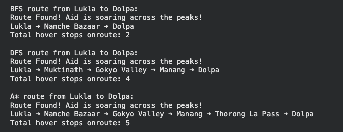
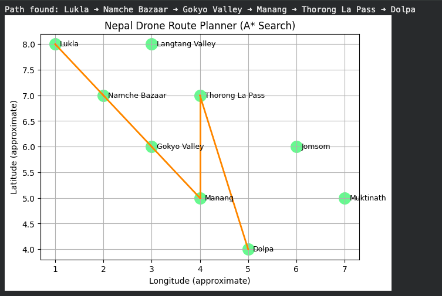

# AI Drone Route Planning in the Nepal Mountain Region
## Overview

This project implements an AI-driven drone navigation system designed to compute safe and efficient routes across mountainous regions in Nepal. The system models the terrain as a weighted graph and applies three classic search algorithms – Breadth-First Search (BFS), Depth-First Search (DFS), and A* – to analyse and compare different navigation strategies.

This work was developed as part of the Applied AI module, demonstrating the use of artificial intelligence techniques for real-world problem-solving, specifically in the context of autonomous aerial navigation where terrain, distance, battery constraints, and accessibility are critical factors.

## Features

- Graph-based model of key locations in the Nepal Himalayan region
- Implementations of BFS, DFS, and A* search algorithms
- Heuristic-based route optimisation using straight-line distance estimates
- Comparative analysis of algorithm performance and route quality
- Visualisation of computed drone routes using Matplotlib
- Simulation of real-world uncertainty through randomised delay factors

## Technologies Used

Python 3.x

Matplotlib

Collections (deque)

Heapq (priority queue)

Random (delay simulation)

Jupyter Notebook

# Algorithms Implemented

## Breadth-First Search (BFS)

Explores the search graph level by level.
Guarantees the fewest number of hops but not the shortest physical distance.
Used as a baseline for comparison.

## Depth-First Search (DFS)

Explores along a single path as deeply as possible before backtracking.
Not distance-aware and can produce suboptimal routes.
Useful for demonstrating limitations in navigation contexts.

## A* Search Algorithm*

Combines the actual cost (g-score) and an admissible heuristic (straight-line estimate).
Produces efficient and realistic routes for drone flight.
Most appropriate for autonomous navigation in this scenario.

# System Architecture

The system includes the following components:

User input (start location, destination, search algorithm)

Graph representation of Nepal’s mountainous regions

Algorithm selection module

Search engine (BFS, DFS, A*)

Heuristic evaluation module

Route computation

Visualisation of the final path

A high-level diagram showing the overall system architecture and data flow is provided below.

# Dataset / Graph Description

The Himalayan region is represented as a weighted graph where:

Nodes are major waypoints (Lukla, Namche Bazaar, Gokyo Valley, etc.)

Edges represent possible drone flight paths with approximate distances (km)

The heuristic estimates straight-line distance to the goal region

This abstraction provides a simplified but practical model for demonstrating navigation algorithms.

# Route Visualisation

## Route Visualisation Example

Below is an example of a route generated using the A* search algorithm, visualised on a simplified 2D map of the Nepal region.

# How to Run

Clone the repository:

git clone https://github.com/<your-username>/<repo-name>.git

Open the Jupyter notebook:

jupyter notebook

Run all cells to:

Generate routes using BFS, DFS, and A*

Calculate distance and delay

View the plotted navigation path

# Project Structure
/notebooks
    DroneRoutePlanner.ipynb

/diagrams
    system_architecture.png

/code
    pathfinding.py

README.md

# Evaluation Summary

BFS finds simple routes with few transitions but does not minimise travel distance.

DFS is inefficient for geographic navigation due to deep and potentially irrelevant exploration.

A* consistently produces the most appropriate path for drone navigation because it incorporates both cost and heuristic estimation.

# Use Cases

Autonomous drone navigation in difficult terrain

Route optimisation research

Disaster response and supply delivery planning

Demonstration of classical AI search techniques in real-world contexts

# License

This project is released for educational use. You may reference or adapt the code with proper attribution.

## Author Hamza Hassan - Final-Year Computer Science Student, Cloud & DevOps Enthusiast

## 📫 Connect with Me
[LinkedIn](https://www.linkedin.com/in/hamzahassan21/)
[Youtube](https://www.youtube.com/channel/UC51JEAEBV8WXwf2ZLROvUJw)
