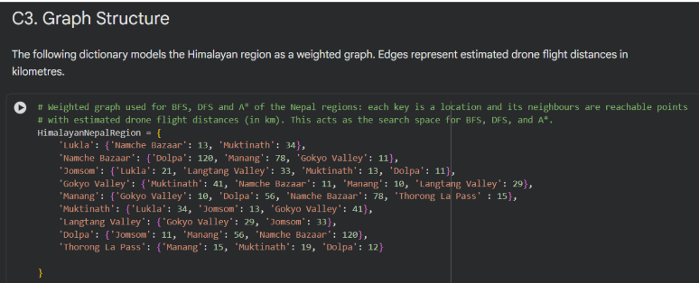
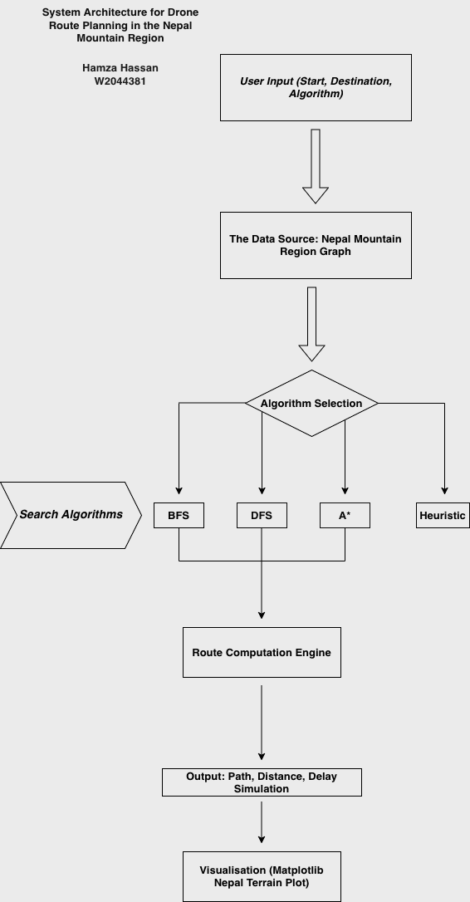
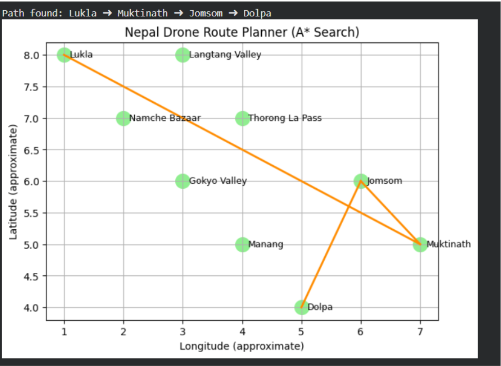
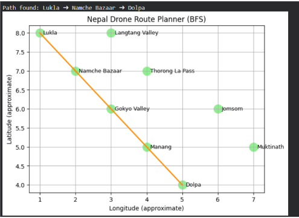
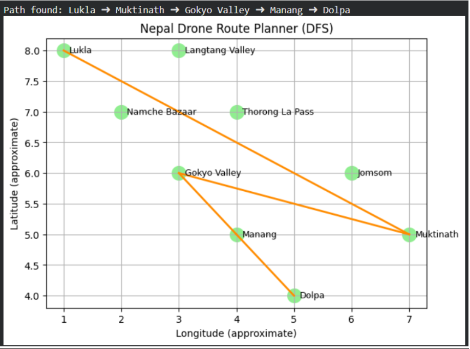
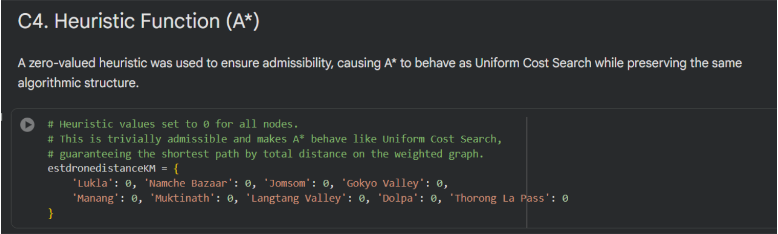

# AI Drone Route Planning in the Nepal Mountain Region
## Overview

This project explores the use of classical Artificial Intelligence search algorithms for autonomous drone navigation in mountainous terrain. The system models key regions of Nepal as a weighted graph and compares the behaviour of Breadth-First Search (BFS), Depth-First Search (DFS), and A* when planning routes between locations.

The work was developed as part of the Applied AI module and focuses on realistic navigation constraints such as distance optimisation, battery efficiency, and route feasibility in high-altitude environments. While simplified, the prototype demonstrates how different AI search strategies behave when applied to a real-world inspired problem.

## Key Features

Manually defined weighted graph representing major regions in Nepal

Implementations of BFS, DFS, and A* search algorithms

Distance-aware route optimisation using weighted edges

Admissible heuristic configuration for A* (Uniform Cost Search behaviour)

Visual comparison of algorithm outputs

Simulation of real-world uncertainty using a random delay factor

Clear system architecture and route visualisation plots

## Technologies Used

Python 3

Jupyter Notebook

Matplotlib (visualisation)

collections.deque (BFS)

heapq (priority queue for A*)

random (delay simulation)

## Algorithms Implemented

### Breadth-First Search (BFS)

Explores the graph level by level

Guarantees the fewest number of hops

Does not minimise physical distance

Used as a baseline for comparison

### Depth-First Search (DFS)

Explores one path deeply before backtracking

Memory-efficient but highly inefficient for navigation

Often produces long, unrealistic routes

### A* Search (Uniform Cost Configuration)

Uses path cost accumulation to prioritise routes

Heuristic values are set to zero to ensure admissibility

Guarantees the shortest path by total distance on the weighted graph

Produces the most realistic routes for drone navigation

## System Architecture

The system follows a clear and interpretable pipeline:

User selects start location, destination, and algorithm

A predefined Nepal mountain graph is used as the data source

The selected algorithm (BFS, DFS, or A*) computes a route

Total distance and delay are calculated

The final path is visualised on a simplified map

### System Architecture Diagram:

## Dataset / Graph Description

No external dataset is used. Instead, the environment is manually defined to keep the focus on algorithmic behaviour.

Nodes represent key locations (e.g. Lukla, Namche Bazaar, Dolpa)

Edges represent possible drone flight paths

Edge weights represent estimated flight distances (km)

The graph serves as the complete search space for all algorithms

This controlled setup allows for transparent comparison between search techniques.

## Route Visualisation Examples

Each algorithm produces a visibly different route:

A* Route (Shortest Distance ~ 58km) 

BFS Route (Fewest Stops ~ 131km)

DFS Route (Inefficient Exploration ~ 141km)

Heuristic Configuration 

To guarantee correctness and avoid over-optimistic estimates, the heuristic values for A* are set to zero for all nodes. This makes A* behave as Uniform Cost Search, ensuring the shortest path by distance on the weighted graph.

## Project Structure
/notebooks
  
  AI_Drone_Route_Planning_Nepal.ipynb

/diagrams

  system_architecture_nepal_drone_ai.drawio.png
  
  a_star_route_plot.png
  
  bfs_route_plot.png
  
  dfs_route_plot.png
  
  route_visualisation.png
  
  weighted_graph.png
  
  heuristic_distance_dictionairy.png

/README.md

## Evaluation Summary

BFS finds short paths in terms of hops but ignores distance

DFS is unsuitable for navigation due to inefficient exploration

A* consistently produces the most realistic routes by minimising total distance

The results clearly demonstrate why distance-aware search is essential for autonomous drone navigation in mountainous regions.

## Use Cases

Drone route planning in remote or high-altitude terrain

Humanitarian supply delivery and rescue planning

Teaching and demonstration of classical AI search algorithms

Algorithm comparison in applied AI coursework

## Demo Video

A short video walkthrough demonstrates the notebook, explains each algorithm, and shows how the routes are generated and visualised.

YouTube Demo: https://www.youtube.com/watch?v=6Ufuo1ziNpM&t=1s

## License

This project is intended for educational use. You are welcome to reference or adapt the work with appropriate attribution.

## Author

Hamza Hassan
Final-Year Computer Science Student
Cloud & DevOps Enthusiast

## 📫 Connect with me:

LinkedIn: https://www.linkedin.com/in/hamzahassan21/

YouTube: https://www.youtube.com/@hamzahassan2121
